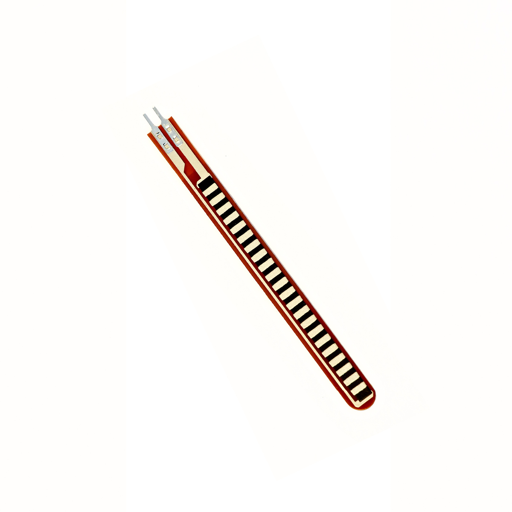

---
title: "Biegesensor"
date: "2018-10-01T13:36:00.000Z"
tags: 
  - "sensor"
coverImage: "20_biegesensor.jpg"
material_number: "20"
material_type: "sensor"
material_short_descr: "Flex Sensor 2.2\""
manufacture: "Spectra Symbol"
manufacture_url: "https://www.spectrasymbol.com/"
repo_name: "mks-SpectraSymbol-Flex_Sensor_v1"
repo_prefix: "mks"
repo_manufacture: "SpectraSymbol"
repo_part: "Flex_Sensor_v1"
product_url: "https://store.spectrasymbol.com/products/spectraflex-flex-sensor?variant=40919797399667"
clone_url: "https://github.com/Make-Your-School/mks-SpectraSymbol-Flex_Sensor_v1.git"
embedded_example_file: "examples/Flex_Sensor_v1_minimal/Flex_Sensor_v1_minimal.ino"
---

# Biegesensor

## Beschreibung
Der Biegesensor ermöglicht es, Verbiegungen zu erkennen und deren Ausmaß zu bestimmen. Wird der Fühler des Sensors gebogen (Aufrollbewegung mit den Metallplättchen nach außen), ändert sich der elektrische Widerstand zwischen den Anschlusspins. Durch eine Widerstandsmessung kann folglich auf die Biegung des Fühlers geschlossen werden.

Da ein Arduino nicht direkt eine Widerstandsänderung messen kann, wird hier eine Messverstärkerschaltung benötigt. Eine Möglichkeit bietet hierfür ein sogenannter Spannungsteiler, bei dem der Sensor in Reihe mit einem zweiten Widerstand zwischen Versorgungsspannung und Masse gelegt wird. Der Arduino kann schließlich die Widerstandsänderung als Spannungsänderung über einen \[simple\_tooltip content='

Digital vs. analog:

- Analoge Signale können beliebige kontinuierliche Werte annehmen. Sie verändern sich stufenlos. Dadurch können theoretisch unendlich viele kleine Änderungen (und damit ein unendlicher Informationsinhalt) übertragen werden. Einschränkend wirkt die Genauigkeit, mit der das analoge Signal ausgelesen/erfasst wird.
- Das digitale Signal nimmt nur diskrete Werte an und springt bei einer etwaigen Änderung von einem Wert zum nächsten. Es kann nur eine definierte Anzahl an Informationsinhalten übertragen werden. Vorteilhaft ist dagegen die damit verbundene Fehlerfreiheit bei minimalsten, ungewollten Schwankungen. Oftmals werden nur zwei Werte HIGH und LOW (Ein/Aus oder 1/0) übermittelt.

'\]analogen\[/simple\_tooltip\] \[simple\_tooltip content='Die Mikrocontroller besitzen kleine metallische Kontakte, an die Komponenten, Shields oder andere Platinen angeschlossen werden können. Diese Kontakte werden Pins genannt und können oft als sogenannte GPIO’s (Allzweck Ein- und Ausgabe) eingesetzt werden. Dies bedeutet, dass diese Pins direkt über die Programmierung des Mikrocontrollers angesprochen werden können und hierbei sogar bestimmt werden kann, ob dieser Pin als Eingang (beispielsweise zum Auslesen eines Sensors) oder als Ausgang (beispielsweise zur Steuerung eines Motors) genutzt werden kann. Praktisches Beispiel: Wird am Arduino eine LED an Pin 1 angeschlossen, kann im Programm direkt der Pin 1 als „An“ oder „Aus“ definiert werden und damit die LED an- oder ausgeschaltet werden. '\]Pin\[/simple\_tooltip\] erfassen.

Eine häufige Anwendung des Biegesensors ist die Nutzung in einem Sensorhandschuh. Hier kann unter anderem die Beugung der Finger erfasst werden.

Man findet über alle gängigen Suchmaschinen meist nur mit der Eingabe der genauen Komponentenbezeichnung entsprechende Projektbeispiele und Tutorials. Hierbei ist das wichtige Stichwort „FSR“ (force sensing resistor).

<!-- infolist -->

<!-- infolists -->
## Wichtige Links für die ersten Schritte:

- [Datenblatt](https://www.sparkfun.com/datasheets/Sensors/Flex/flex22.pdf) [- Flexsensor 2.2”](https://www.sparkfun.com/datasheets/Sensors/Flex/flex22.pdf)

## Projektbeispiele:

- [Instructables - Beispielnutzung Biegesensor](https://www.instructables.com/id/How-to-use-a-Flex-Sensor-Arduino-Tutorial/)

## Weiterführende Hintergrundinformationen:

- [Spannungsteiler - Wikipedia Artikel](https://de.wikipedia.org/wiki/Spannungsteiler)
- [Messverstärker - Wikipedia Artikel](https://de.wikipedia.org/wiki/Messverst%C3%A4rker)
- [Force Sensing Resistor - Wikipedia Artikel](https://de.wikipedia.org/wiki/Force_Sensing_Resistor)
- [GPIO - Wikipedia Artikel](https://de.wikipedia.org/wiki/Allzweckeingabe/-ausgabe)
- [GitHub-Repository: Biegesensor](https://github.com/MakeYourSchool/20-Biegesensor)

