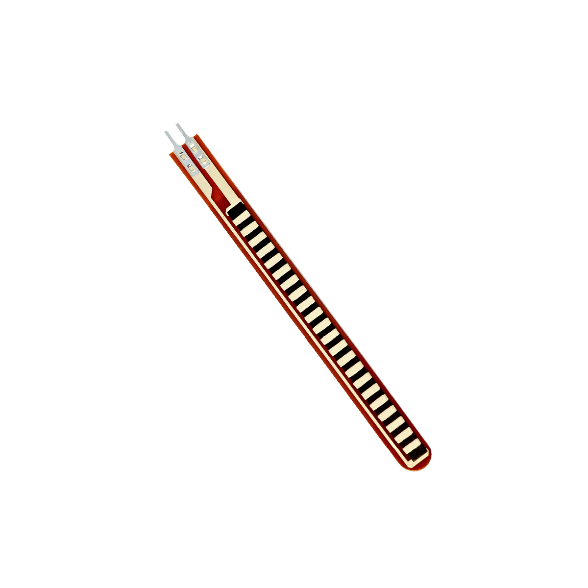

# Biegesensor

## Beschreibung
Der Biegesensor ermöglicht es, Verbiegungen zu erkennen und deren Ausmaß zu bestimmen. Wird der Fühler des Sensors gebogen (Aufrollbewegung mit den Metallplättchen nach außen), ändert sich der elektrische Widerstand zwischen den Anschlusspins. Durch eine Widerstandsmessung kann folglich auf die Biegung des Fühlers geschlossen werden.

Da ein Arduino nicht direkt eine Widerstandsänderung messen kann, wird hier eine Messverstärkerschaltung benötigt. Eine Möglichkeit bietet hierfür ein sogenannter Spannungsteiler, bei dem der Sensor in Reihe mit einem zweiten Widerstand zwischen Versorgungsspannung und Masse gelegt wird. Der Arduino kann schließlich die Widerstandsänderung als Spannungsänderung über einen analogen Pin erfassen.

Eine häufige Anwendung des Biegesensors ist die Nutzung in einem Sensorhandschuh. Hier kann unter anderem die Beugung der Finger erfasst werden.

Man findet über alle gängigen Suchmaschinen meist nur mit der Eingabe der genauen Komponentenbezeichnung entsprechende Projektbeispiele und Tutorials. Hierbei ist das wichtige Stichwort „FSR“ (force sensing resistor).

## Beispiele

!!!show-examples:./examples/

<!-- infolist -->

## Wichtige Links für die ersten Schritte:

- [Datenblatt](https://www.sparkfun.com/datasheets/Sensors/Flex/flex22.pdf) [- Flexsensor 2.2”](https://www.sparkfun.com/datasheets/Sensors/Flex/flex22.pdf)

## Projektbeispiele:

- [Instructables - Beispielnutzung Biegesensor](https://www.instructables.com/id/How-to-use-a-Flex-Sensor-Arduino-Tutorial/)

## Weiterführende Hintergrundinformationen:

- [Spannungsteiler - Wikipedia Artikel](https://de.wikipedia.org/wiki/Spannungsteiler)
- [Messverstärker - Wikipedia Artikel](https://de.wikipedia.org/wiki/Messverst%C3%A4rker)
- [Force Sensing Resistor - Wikipedia Artikel](https://de.wikipedia.org/wiki/Force_Sensing_Resistor)
- [GPIO - Wikipedia Artikel](https://de.wikipedia.org/wiki/Allzweckeingabe/-ausgabe)
- [GitHub-Repository: Biegesensor](https://github.com/MakeYourSchool/20-Biegesensor)

